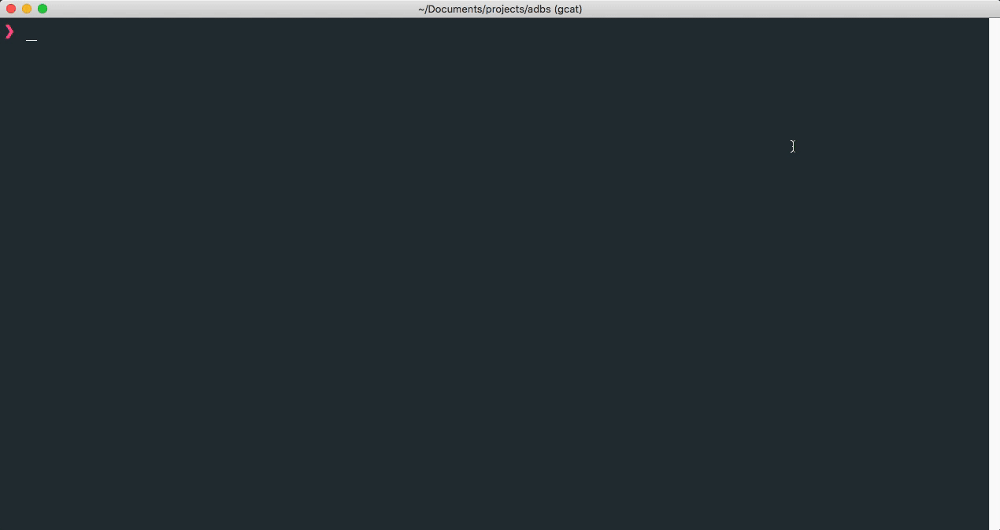

<div align="center">
  
  <p align="center" style="margin-bottom: 100px">
    Seamless work with multiple Android devices using <a href="https://developer.android.com/studio/command-line/adb.html"><b>android debug bridge</b></a>.
  </p>

  
</div>

## Features:

1. Helps distributing `adb` commands to multiple devices/emulators

2. If more than one device/emulator is running, prompt will ask for target

3. You can specify targets upfront (see [**Usage**](#usage))

4. Can be used **interchangeably** with `adb`


## Install

Install CLI globally

```
npm i -g adbs 


# or

yarn global add adbs
```


## Usage


```
  $ adbs [adbs options] [adb command]

  Options
    all                     Run commands on all devices
    dev                     Run commands on all physical devices
    emu                     Run commands on all running emulators
    help    | -h             Displays this screen
    version | -v            Display current adbs version
  
  Examples
    $ adbs all shell netstat
    $ adbs emu install app.apk
```


## License

[MIT](./LICENSE)